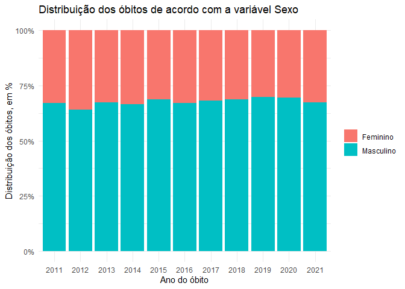
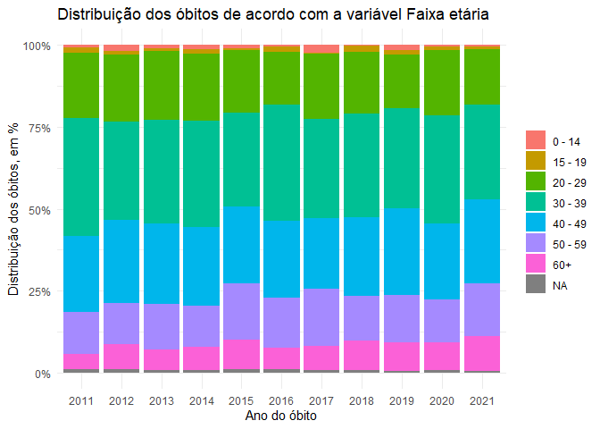
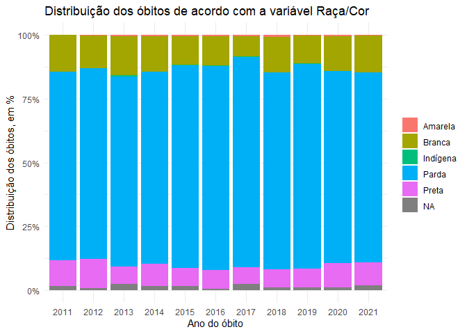
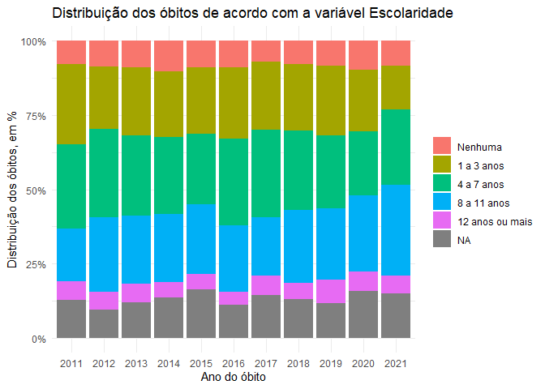
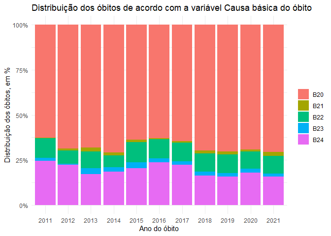

Análise histórica dos óbitos por doenças associadas ao HIV no Estado do
Pará
================
Márcio V de G Affonso
2022-12-11

Considerando que estamos no mês **Dezembro Vermelho**, alusivo ao
combate ao HIV/AIDS, buscou-se fazer uma análise histórica dos óbitos
por doenças associadas ao HIV no Estado do Pará, no período entre 2011 e
2021. Os dados aqui utilizados estão disponíveis para consulta de forma
agregada no
[DATASUS](https://datasus.saude.gov.br/informacoes-de-saude-tabnet/),
que consolida as informações do **Sistema de Informação sobre
Mortalidade** (SIM). Contudo, neste relatório foi utilizado o pacote
`microdatasus`1, o qual permite a extração dos dados
individualizados.

1
[Link](https://www.scielo.br/j/csp/a/gdJXqcrW5PPDHX8rwPDYL7F/?lang=pt)
para acessar o artigo intitulado **Microdatasus: pacote para download e
pré-processamento de microdados do Departamento de Informática do SUS
(DATASUS)**.

## Introdução

- O que é o HIV?

  - De acordo com o Ministério da Saúde2, HIV é a sigla em
    inglês do vírus da imunodeficiência humana, causador da **AIDS**.
    Esse vírus ataca o sistema imunológico, especialmente as células
    chamadas de linfócitos T CD4+. E é alterando o DNA dessa célula que
    o HIV se multiplica no organismo para continuar a infecção.

- Doença pelo vírus da imunodeficiência humana (HIV)

  - Na Classificação Estatística Internacional de Doenças e Problemas
    Relacionados à Saúde – 10ª Revisão (CID-10), os códigos B20 a B24
    compõem o grupo Doença pelo vírus da imunodeficiência humana. Tais
    códigos são:

    - B20: Doença pelo vírus da imunodeficiência humana \[HIV\],
      resultando em doenças infecciosas e parasitárias
    - B21: Doença pelo vírus da imunodeficiência humana \[HIV\],
      resultando em neoplasias malignas
    - B22: Doença pelo vírus da imunodeficiência humana \[HIV\],
      resultando em outras doenças especificadas
    - B23: Doença pelo vírus da imunodeficiência humana \[HIV\],
      resultando em outras doenças
    - B24: Doença pelo vírus da imunodeficiência humana \[HIV\], não
      especificada

2 Página do [Ministério da
Saúde](https://www.gov.br/aids/pt-br/assuntos/hiv-aids/o-que-e) sobre o
HIV/aids.

## Análises

### 1. Distribuição dos óbitos por doenças pelo HIV: um corte transversal

Durante o período entre 2011 e 2021 no Estado do Pará foram registrados
**7023** óbitos por doenças pelo HIV no SIM, o que representa **1.61%**
do total de óbitos registrados (437007).

A **Tabela 1**, que sumariza as características dos óbitos que ocorreram
nesse período, pode ser vista abaixo:

<table class="gt_table">
  
  <thead class="gt_col_headings">
    <tr>
      <th class="gt_col_heading gt_columns_bottom_border gt_left" rowspan="1" colspan="1" scope="col" id="&lt;strong&gt;Characteristic&lt;/strong&gt;"><strong>Characteristic</strong></th>
      <th class="gt_col_heading gt_columns_bottom_border gt_center" rowspan="1" colspan="1" scope="col" id="&lt;strong&gt;N = 7,023&lt;/strong&gt;&lt;sup class=&quot;gt_footnote_marks&quot;&gt;1&lt;/sup&gt;"><strong>N = 7,023</strong>1</th>
    </tr>
  </thead>
  <tbody class="gt_table_body">
    <tr><td headers="label" class="gt_row gt_left">Sexo</td>
<td headers="stat_0" class="gt_row gt_center"></td></tr>
    <tr><td headers="label" class="gt_row gt_left">    Feminino</td>
<td headers="stat_0" class="gt_row gt_center">2,263 (32%)</td></tr>
    <tr><td headers="label" class="gt_row gt_left">    Masculino</td>
<td headers="stat_0" class="gt_row gt_center">4,760 (68%)</td></tr>
    <tr><td headers="label" class="gt_row gt_left">Faixa etária</td>
<td headers="stat_0" class="gt_row gt_center"></td></tr>
    <tr><td headers="label" class="gt_row gt_left">    0 - 14</td>
<td headers="stat_0" class="gt_row gt_center">70 (1.0%)</td></tr>
    <tr><td headers="label" class="gt_row gt_left">    15 - 19</td>
<td headers="stat_0" class="gt_row gt_center">80 (1.1%)</td></tr>
    <tr><td headers="label" class="gt_row gt_left">    20 - 29</td>
<td headers="stat_0" class="gt_row gt_center">1,327 (19%)</td></tr>
    <tr><td headers="label" class="gt_row gt_left">    30 - 39</td>
<td headers="stat_0" class="gt_row gt_center">2,219 (32%)</td></tr>
    <tr><td headers="label" class="gt_row gt_left">    40 - 49</td>
<td headers="stat_0" class="gt_row gt_center">1,699 (24%)</td></tr>
    <tr><td headers="label" class="gt_row gt_left">    50 - 59</td>
<td headers="stat_0" class="gt_row gt_center">1,021 (15%)</td></tr>
    <tr><td headers="label" class="gt_row gt_left">    60+</td>
<td headers="stat_0" class="gt_row gt_center">555 (8.0%)</td></tr>
    <tr><td headers="label" class="gt_row gt_left">    Unknown</td>
<td headers="stat_0" class="gt_row gt_center">52</td></tr>
    <tr><td headers="label" class="gt_row gt_left">Raça/Cor</td>
<td headers="stat_0" class="gt_row gt_center"></td></tr>
    <tr><td headers="label" class="gt_row gt_left">    Amarela</td>
<td headers="stat_0" class="gt_row gt_center">23 (0.3%)</td></tr>
    <tr><td headers="label" class="gt_row gt_left">    Branca</td>
<td headers="stat_0" class="gt_row gt_center">891 (13%)</td></tr>
    <tr><td headers="label" class="gt_row gt_left">    Indígena</td>
<td headers="stat_0" class="gt_row gt_center">10 (0.1%)</td></tr>
    <tr><td headers="label" class="gt_row gt_left">    Parda</td>
<td headers="stat_0" class="gt_row gt_center">5,426 (78%)</td></tr>
    <tr><td headers="label" class="gt_row gt_left">    Preta</td>
<td headers="stat_0" class="gt_row gt_center">575 (8.3%)</td></tr>
    <tr><td headers="label" class="gt_row gt_left">    Unknown</td>
<td headers="stat_0" class="gt_row gt_center">98</td></tr>
    <tr><td headers="label" class="gt_row gt_left">Escolaridade</td>
<td headers="stat_0" class="gt_row gt_center"></td></tr>
    <tr><td headers="label" class="gt_row gt_left">    Nenhuma</td>
<td headers="stat_0" class="gt_row gt_center">602 (9.9%)</td></tr>
    <tr><td headers="label" class="gt_row gt_left">    1 a 3 anos</td>
<td headers="stat_0" class="gt_row gt_center">1,551 (25%)</td></tr>
    <tr><td headers="label" class="gt_row gt_left">    4 a 7 anos</td>
<td headers="stat_0" class="gt_row gt_center">1,851 (30%)</td></tr>
    <tr><td headers="label" class="gt_row gt_left">    8 a 11 anos</td>
<td headers="stat_0" class="gt_row gt_center">1,666 (27%)</td></tr>
    <tr><td headers="label" class="gt_row gt_left">    12 anos ou mais</td>
<td headers="stat_0" class="gt_row gt_center">422 (6.9%)</td></tr>
    <tr><td headers="label" class="gt_row gt_left">    Unknown</td>
<td headers="stat_0" class="gt_row gt_center">931</td></tr>
    <tr><td headers="label" class="gt_row gt_left">Causa básica do óbito</td>
<td headers="stat_0" class="gt_row gt_center"></td></tr>
    <tr><td headers="label" class="gt_row gt_left">    B20</td>
<td headers="stat_0" class="gt_row gt_center">4,743 (68%)</td></tr>
    <tr><td headers="label" class="gt_row gt_left">    B21</td>
<td headers="stat_0" class="gt_row gt_center">93 (1.3%)</td></tr>
    <tr><td headers="label" class="gt_row gt_left">    B22</td>
<td headers="stat_0" class="gt_row gt_center">680 (9.7%)</td></tr>
    <tr><td headers="label" class="gt_row gt_left">    B23</td>
<td headers="stat_0" class="gt_row gt_center">154 (2.2%)</td></tr>
    <tr><td headers="label" class="gt_row gt_left">    B24</td>
<td headers="stat_0" class="gt_row gt_center">1,353 (19%)</td></tr>
    <tr><td headers="label" class="gt_row gt_left">Ano do óbito</td>
<td headers="stat_0" class="gt_row gt_center"></td></tr>
    <tr><td headers="label" class="gt_row gt_left">    2011</td>
<td headers="stat_0" class="gt_row gt_center">507 (7.2%)</td></tr>
    <tr><td headers="label" class="gt_row gt_left">    2012</td>
<td headers="stat_0" class="gt_row gt_center">514 (7.3%)</td></tr>
    <tr><td headers="label" class="gt_row gt_left">    2013</td>
<td headers="stat_0" class="gt_row gt_center">601 (8.6%)</td></tr>
    <tr><td headers="label" class="gt_row gt_left">    2014</td>
<td headers="stat_0" class="gt_row gt_center">625 (8.9%)</td></tr>
    <tr><td headers="label" class="gt_row gt_left">    2015</td>
<td headers="stat_0" class="gt_row gt_center">664 (9.5%)</td></tr>
    <tr><td headers="label" class="gt_row gt_left">    2016</td>
<td headers="stat_0" class="gt_row gt_center">669 (9.5%)</td></tr>
    <tr><td headers="label" class="gt_row gt_left">    2017</td>
<td headers="stat_0" class="gt_row gt_center">667 (9.5%)</td></tr>
    <tr><td headers="label" class="gt_row gt_left">    2018</td>
<td headers="stat_0" class="gt_row gt_center">687 (9.8%)</td></tr>
    <tr><td headers="label" class="gt_row gt_left">    2019</td>
<td headers="stat_0" class="gt_row gt_center">709 (10%)</td></tr>
    <tr><td headers="label" class="gt_row gt_left">    2020</td>
<td headers="stat_0" class="gt_row gt_center">672 (9.6%)</td></tr>
    <tr><td headers="label" class="gt_row gt_left">    2021</td>
<td headers="stat_0" class="gt_row gt_center">708 (10%)</td></tr>
  </tbody>
  
  <tfoot class="gt_footnotes">
    <tr>
      <td class="gt_footnote" colspan="2">1 n (%)</td>
    </tr>
  </tfoot>
</table>

A partir dessa tabela podemos chegar a algumas conclusões, são elas:

- **68%** do total de indivíduos que foram a óbito eram do sexo
  masculino.

- **78%** do total de óbitos foram registrados como pardos.

- **65%** do total de indivíduos que foram a óbitos possuíam menos de 8
  anos de estudo.

- **68%** dos óbitos foram devido a doenças infecciosas e parasitárias,
  resultantes da infecção por HIV.

- **90%** dos óbitos se concentraram na faixa etária de 20 a 59 anos.

Quanto à distribuição dos óbitos, tais achados nos auxiliam na
identificação de alguns grupos predominantes, contudo apenas essa
análise transversal não é suficiente para identificarmos possíveis
nuances e variações. Portanto, é necessária também uma análise temporal.

### 2. Análise histórica dos óbitos por doenças pelo HIV: houve diferença ao longo dos anos?

Considerando os resultados acima, buscou-se identificar se houve alguma
mudança no perfil epidemiológico dos indivíduos que evoluíram a óbito
devido doenças pelo HIV, no período de 2011 a 2021.

No geral, em 2011, foram registrados **507** óbitos por doenças pelo
HIV, o que representou **1.55%** do total de mortes. Já em 2021, o
número de óbitos foi de **708**, **1.36%** do total.

A **Tabela 2** por sua vez sumariza os resultados observados ao longo do
período do estudo:

<table class="gt_table">
  
  <thead class="gt_col_headings">
    <tr>
      <th class="gt_col_heading gt_columns_bottom_border gt_left" rowspan="1" colspan="1" scope="col" id="&lt;strong&gt;Characteristic&lt;/strong&gt;"><strong>Characteristic</strong></th>
      <th class="gt_col_heading gt_columns_bottom_border gt_center" rowspan="1" colspan="1" scope="col" id="&lt;strong&gt;2011&lt;/strong&gt;, N = 507&lt;sup class=&quot;gt_footnote_marks&quot;&gt;1&lt;/sup&gt;"><strong>2011</strong>, N = 5071</th>
      <th class="gt_col_heading gt_columns_bottom_border gt_center" rowspan="1" colspan="1" scope="col" id="&lt;strong&gt;2012&lt;/strong&gt;, N = 514&lt;sup class=&quot;gt_footnote_marks&quot;&gt;1&lt;/sup&gt;"><strong>2012</strong>, N = 5141</th>
      <th class="gt_col_heading gt_columns_bottom_border gt_center" rowspan="1" colspan="1" scope="col" id="&lt;strong&gt;2013&lt;/strong&gt;, N = 601&lt;sup class=&quot;gt_footnote_marks&quot;&gt;1&lt;/sup&gt;"><strong>2013</strong>, N = 6011</th>
      <th class="gt_col_heading gt_columns_bottom_border gt_center" rowspan="1" colspan="1" scope="col" id="&lt;strong&gt;2014&lt;/strong&gt;, N = 625&lt;sup class=&quot;gt_footnote_marks&quot;&gt;1&lt;/sup&gt;"><strong>2014</strong>, N = 6251</th>
      <th class="gt_col_heading gt_columns_bottom_border gt_center" rowspan="1" colspan="1" scope="col" id="&lt;strong&gt;2015&lt;/strong&gt;, N = 664&lt;sup class=&quot;gt_footnote_marks&quot;&gt;1&lt;/sup&gt;"><strong>2015</strong>, N = 6641</th>
      <th class="gt_col_heading gt_columns_bottom_border gt_center" rowspan="1" colspan="1" scope="col" id="&lt;strong&gt;2016&lt;/strong&gt;, N = 669&lt;sup class=&quot;gt_footnote_marks&quot;&gt;1&lt;/sup&gt;"><strong>2016</strong>, N = 6691</th>
      <th class="gt_col_heading gt_columns_bottom_border gt_center" rowspan="1" colspan="1" scope="col" id="&lt;strong&gt;2017&lt;/strong&gt;, N = 667&lt;sup class=&quot;gt_footnote_marks&quot;&gt;1&lt;/sup&gt;"><strong>2017</strong>, N = 6671</th>
      <th class="gt_col_heading gt_columns_bottom_border gt_center" rowspan="1" colspan="1" scope="col" id="&lt;strong&gt;2018&lt;/strong&gt;, N = 687&lt;sup class=&quot;gt_footnote_marks&quot;&gt;1&lt;/sup&gt;"><strong>2018</strong>, N = 6871</th>
      <th class="gt_col_heading gt_columns_bottom_border gt_center" rowspan="1" colspan="1" scope="col" id="&lt;strong&gt;2019&lt;/strong&gt;, N = 709&lt;sup class=&quot;gt_footnote_marks&quot;&gt;1&lt;/sup&gt;"><strong>2019</strong>, N = 7091</th>
      <th class="gt_col_heading gt_columns_bottom_border gt_center" rowspan="1" colspan="1" scope="col" id="&lt;strong&gt;2020&lt;/strong&gt;, N = 672&lt;sup class=&quot;gt_footnote_marks&quot;&gt;1&lt;/sup&gt;"><strong>2020</strong>, N = 6721</th>
      <th class="gt_col_heading gt_columns_bottom_border gt_center" rowspan="1" colspan="1" scope="col" id="&lt;strong&gt;2021&lt;/strong&gt;, N = 708&lt;sup class=&quot;gt_footnote_marks&quot;&gt;1&lt;/sup&gt;"><strong>2021</strong>, N = 7081</th>
    </tr>
  </thead>
  <tbody class="gt_table_body">
    <tr><td headers="label" class="gt_row gt_left">Sexo</td>
<td headers="stat_1" class="gt_row gt_center"></td>
<td headers="stat_2" class="gt_row gt_center"></td>
<td headers="stat_3" class="gt_row gt_center"></td>
<td headers="stat_4" class="gt_row gt_center"></td>
<td headers="stat_5" class="gt_row gt_center"></td>
<td headers="stat_6" class="gt_row gt_center"></td>
<td headers="stat_7" class="gt_row gt_center"></td>
<td headers="stat_8" class="gt_row gt_center"></td>
<td headers="stat_9" class="gt_row gt_center"></td>
<td headers="stat_10" class="gt_row gt_center"></td>
<td headers="stat_11" class="gt_row gt_center"></td></tr>
    <tr><td headers="label" class="gt_row gt_left">    Feminino</td>
<td headers="stat_1" class="gt_row gt_center">167 (33%)</td>
<td headers="stat_2" class="gt_row gt_center">185 (36%)</td>
<td headers="stat_3" class="gt_row gt_center">196 (33%)</td>
<td headers="stat_4" class="gt_row gt_center">210 (34%)</td>
<td headers="stat_5" class="gt_row gt_center">207 (31%)</td>
<td headers="stat_6" class="gt_row gt_center">220 (33%)</td>
<td headers="stat_7" class="gt_row gt_center">213 (32%)</td>
<td headers="stat_8" class="gt_row gt_center">214 (31%)</td>
<td headers="stat_9" class="gt_row gt_center">214 (30%)</td>
<td headers="stat_10" class="gt_row gt_center">205 (31%)</td>
<td headers="stat_11" class="gt_row gt_center">232 (33%)</td></tr>
    <tr><td headers="label" class="gt_row gt_left">    Masculino</td>
<td headers="stat_1" class="gt_row gt_center">340 (67%)</td>
<td headers="stat_2" class="gt_row gt_center">329 (64%)</td>
<td headers="stat_3" class="gt_row gt_center">405 (67%)</td>
<td headers="stat_4" class="gt_row gt_center">415 (66%)</td>
<td headers="stat_5" class="gt_row gt_center">457 (69%)</td>
<td headers="stat_6" class="gt_row gt_center">449 (67%)</td>
<td headers="stat_7" class="gt_row gt_center">454 (68%)</td>
<td headers="stat_8" class="gt_row gt_center">473 (69%)</td>
<td headers="stat_9" class="gt_row gt_center">495 (70%)</td>
<td headers="stat_10" class="gt_row gt_center">467 (69%)</td>
<td headers="stat_11" class="gt_row gt_center">476 (67%)</td></tr>
    <tr><td headers="label" class="gt_row gt_left">Faixa etária</td>
<td headers="stat_1" class="gt_row gt_center"></td>
<td headers="stat_2" class="gt_row gt_center"></td>
<td headers="stat_3" class="gt_row gt_center"></td>
<td headers="stat_4" class="gt_row gt_center"></td>
<td headers="stat_5" class="gt_row gt_center"></td>
<td headers="stat_6" class="gt_row gt_center"></td>
<td headers="stat_7" class="gt_row gt_center"></td>
<td headers="stat_8" class="gt_row gt_center"></td>
<td headers="stat_9" class="gt_row gt_center"></td>
<td headers="stat_10" class="gt_row gt_center"></td>
<td headers="stat_11" class="gt_row gt_center"></td></tr>
    <tr><td headers="label" class="gt_row gt_left">    0 - 14</td>
<td headers="stat_1" class="gt_row gt_center">4 (0.8%)</td>
<td headers="stat_2" class="gt_row gt_center">9 (1.8%)</td>
<td headers="stat_3" class="gt_row gt_center">6 (1.0%)</td>
<td headers="stat_4" class="gt_row gt_center">7 (1.1%)</td>
<td headers="stat_5" class="gt_row gt_center">6 (0.9%)</td>
<td headers="stat_6" class="gt_row gt_center">2 (0.3%)</td>
<td headers="stat_7" class="gt_row gt_center">16 (2.4%)</td>
<td headers="stat_8" class="gt_row gt_center">2 (0.3%)</td>
<td headers="stat_9" class="gt_row gt_center">11 (1.6%)</td>
<td headers="stat_10" class="gt_row gt_center">3 (0.4%)</td>
<td headers="stat_11" class="gt_row gt_center">4 (0.6%)</td></tr>
    <tr><td headers="label" class="gt_row gt_left">    15 - 19</td>
<td headers="stat_1" class="gt_row gt_center">8 (1.6%)</td>
<td headers="stat_2" class="gt_row gt_center">6 (1.2%)</td>
<td headers="stat_3" class="gt_row gt_center">5 (0.8%)</td>
<td headers="stat_4" class="gt_row gt_center">10 (1.6%)</td>
<td headers="stat_5" class="gt_row gt_center">4 (0.6%)</td>
<td headers="stat_6" class="gt_row gt_center">11 (1.7%)</td>
<td headers="stat_7" class="gt_row gt_center">2 (0.3%)</td>
<td headers="stat_8" class="gt_row gt_center">12 (1.8%)</td>
<td headers="stat_9" class="gt_row gt_center">10 (1.4%)</td>
<td headers="stat_10" class="gt_row gt_center">8 (1.2%)</td>
<td headers="stat_11" class="gt_row gt_center">4 (0.6%)</td></tr>
    <tr><td headers="label" class="gt_row gt_left">    20 - 29</td>
<td headers="stat_1" class="gt_row gt_center">101 (20%)</td>
<td headers="stat_2" class="gt_row gt_center">105 (21%)</td>
<td headers="stat_3" class="gt_row gt_center">126 (21%)</td>
<td headers="stat_4" class="gt_row gt_center">128 (21%)</td>
<td headers="stat_5" class="gt_row gt_center">127 (19%)</td>
<td headers="stat_6" class="gt_row gt_center">109 (16%)</td>
<td headers="stat_7" class="gt_row gt_center">133 (20%)</td>
<td headers="stat_8" class="gt_row gt_center">129 (19%)</td>
<td headers="stat_9" class="gt_row gt_center">116 (16%)</td>
<td headers="stat_10" class="gt_row gt_center">133 (20%)</td>
<td headers="stat_11" class="gt_row gt_center">120 (17%)</td></tr>
    <tr><td headers="label" class="gt_row gt_left">    30 - 39</td>
<td headers="stat_1" class="gt_row gt_center">182 (36%)</td>
<td headers="stat_2" class="gt_row gt_center">154 (30%)</td>
<td headers="stat_3" class="gt_row gt_center">190 (32%)</td>
<td headers="stat_4" class="gt_row gt_center">202 (33%)</td>
<td headers="stat_5" class="gt_row gt_center">190 (29%)</td>
<td headers="stat_6" class="gt_row gt_center">237 (36%)</td>
<td headers="stat_7" class="gt_row gt_center">201 (30%)</td>
<td headers="stat_8" class="gt_row gt_center">219 (32%)</td>
<td headers="stat_9" class="gt_row gt_center">217 (31%)</td>
<td headers="stat_10" class="gt_row gt_center">222 (33%)</td>
<td headers="stat_11" class="gt_row gt_center">205 (29%)</td></tr>
    <tr><td headers="label" class="gt_row gt_left">    40 - 49</td>
<td headers="stat_1" class="gt_row gt_center">119 (24%)</td>
<td headers="stat_2" class="gt_row gt_center">131 (26%)</td>
<td headers="stat_3" class="gt_row gt_center">149 (25%)</td>
<td headers="stat_4" class="gt_row gt_center">151 (24%)</td>
<td headers="stat_5" class="gt_row gt_center">157 (24%)</td>
<td headers="stat_6" class="gt_row gt_center">157 (24%)</td>
<td headers="stat_7" class="gt_row gt_center">145 (22%)</td>
<td headers="stat_8" class="gt_row gt_center">165 (24%)</td>
<td headers="stat_9" class="gt_row gt_center">187 (26%)</td>
<td headers="stat_10" class="gt_row gt_center">156 (23%)</td>
<td headers="stat_11" class="gt_row gt_center">182 (26%)</td></tr>
    <tr><td headers="label" class="gt_row gt_left">    50 - 59</td>
<td headers="stat_1" class="gt_row gt_center">64 (13%)</td>
<td headers="stat_2" class="gt_row gt_center">65 (13%)</td>
<td headers="stat_3" class="gt_row gt_center">83 (14%)</td>
<td headers="stat_4" class="gt_row gt_center">78 (13%)</td>
<td headers="stat_5" class="gt_row gt_center">113 (17%)</td>
<td headers="stat_6" class="gt_row gt_center">102 (15%)</td>
<td headers="stat_7" class="gt_row gt_center">116 (18%)</td>
<td headers="stat_8" class="gt_row gt_center">94 (14%)</td>
<td headers="stat_9" class="gt_row gt_center">103 (15%)</td>
<td headers="stat_10" class="gt_row gt_center">88 (13%)</td>
<td headers="stat_11" class="gt_row gt_center">115 (16%)</td></tr>
    <tr><td headers="label" class="gt_row gt_left">    60+</td>
<td headers="stat_1" class="gt_row gt_center">24 (4.8%)</td>
<td headers="stat_2" class="gt_row gt_center">39 (7.7%)</td>
<td headers="stat_3" class="gt_row gt_center">38 (6.4%)</td>
<td headers="stat_4" class="gt_row gt_center">45 (7.2%)</td>
<td headers="stat_5" class="gt_row gt_center">60 (9.1%)</td>
<td headers="stat_6" class="gt_row gt_center">44 (6.6%)</td>
<td headers="stat_7" class="gt_row gt_center">49 (7.4%)</td>
<td headers="stat_8" class="gt_row gt_center">61 (8.9%)</td>
<td headers="stat_9" class="gt_row gt_center">62 (8.8%)</td>
<td headers="stat_10" class="gt_row gt_center">58 (8.7%)</td>
<td headers="stat_11" class="gt_row gt_center">75 (11%)</td></tr>
    <tr><td headers="label" class="gt_row gt_left">    Unknown</td>
<td headers="stat_1" class="gt_row gt_center">5</td>
<td headers="stat_2" class="gt_row gt_center">5</td>
<td headers="stat_3" class="gt_row gt_center">4</td>
<td headers="stat_4" class="gt_row gt_center">4</td>
<td headers="stat_5" class="gt_row gt_center">7</td>
<td headers="stat_6" class="gt_row gt_center">7</td>
<td headers="stat_7" class="gt_row gt_center">5</td>
<td headers="stat_8" class="gt_row gt_center">5</td>
<td headers="stat_9" class="gt_row gt_center">3</td>
<td headers="stat_10" class="gt_row gt_center">4</td>
<td headers="stat_11" class="gt_row gt_center">3</td></tr>
    <tr><td headers="label" class="gt_row gt_left">Raça/Cor</td>
<td headers="stat_1" class="gt_row gt_center"></td>
<td headers="stat_2" class="gt_row gt_center"></td>
<td headers="stat_3" class="gt_row gt_center"></td>
<td headers="stat_4" class="gt_row gt_center"></td>
<td headers="stat_5" class="gt_row gt_center"></td>
<td headers="stat_6" class="gt_row gt_center"></td>
<td headers="stat_7" class="gt_row gt_center"></td>
<td headers="stat_8" class="gt_row gt_center"></td>
<td headers="stat_9" class="gt_row gt_center"></td>
<td headers="stat_10" class="gt_row gt_center"></td>
<td headers="stat_11" class="gt_row gt_center"></td></tr>
    <tr><td headers="label" class="gt_row gt_left">    Amarela</td>
<td headers="stat_1" class="gt_row gt_center">0 (0%)</td>
<td headers="stat_2" class="gt_row gt_center">1 (0.2%)</td>
<td headers="stat_3" class="gt_row gt_center">2 (0.3%)</td>
<td headers="stat_4" class="gt_row gt_center">2 (0.3%)</td>
<td headers="stat_5" class="gt_row gt_center">3 (0.5%)</td>
<td headers="stat_6" class="gt_row gt_center">3 (0.5%)</td>
<td headers="stat_7" class="gt_row gt_center">2 (0.3%)</td>
<td headers="stat_8" class="gt_row gt_center">5 (0.7%)</td>
<td headers="stat_9" class="gt_row gt_center">2 (0.3%)</td>
<td headers="stat_10" class="gt_row gt_center">2 (0.3%)</td>
<td headers="stat_11" class="gt_row gt_center">1 (0.1%)</td></tr>
    <tr><td headers="label" class="gt_row gt_left">    Branca</td>
<td headers="stat_1" class="gt_row gt_center">73 (15%)</td>
<td headers="stat_2" class="gt_row gt_center">66 (13%)</td>
<td headers="stat_3" class="gt_row gt_center">93 (16%)</td>
<td headers="stat_4" class="gt_row gt_center">87 (14%)</td>
<td headers="stat_5" class="gt_row gt_center">74 (11%)</td>
<td headers="stat_6" class="gt_row gt_center">77 (12%)</td>
<td headers="stat_7" class="gt_row gt_center">54 (8.3%)</td>
<td headers="stat_8" class="gt_row gt_center">95 (14%)</td>
<td headers="stat_9" class="gt_row gt_center">77 (11%)</td>
<td headers="stat_10" class="gt_row gt_center">92 (14%)</td>
<td headers="stat_11" class="gt_row gt_center">103 (15%)</td></tr>
    <tr><td headers="label" class="gt_row gt_left">    Indígena</td>
<td headers="stat_1" class="gt_row gt_center">0 (0%)</td>
<td headers="stat_2" class="gt_row gt_center">0 (0%)</td>
<td headers="stat_3" class="gt_row gt_center">2 (0.3%)</td>
<td headers="stat_4" class="gt_row gt_center">1 (0.2%)</td>
<td headers="stat_5" class="gt_row gt_center">2 (0.3%)</td>
<td headers="stat_6" class="gt_row gt_center">1 (0.2%)</td>
<td headers="stat_7" class="gt_row gt_center">2 (0.3%)</td>
<td headers="stat_8" class="gt_row gt_center">0 (0%)</td>
<td headers="stat_9" class="gt_row gt_center">2 (0.3%)</td>
<td headers="stat_10" class="gt_row gt_center">0 (0%)</td>
<td headers="stat_11" class="gt_row gt_center">0 (0%)</td></tr>
    <tr><td headers="label" class="gt_row gt_left">    Parda</td>
<td headers="stat_1" class="gt_row gt_center">375 (75%)</td>
<td headers="stat_2" class="gt_row gt_center">384 (75%)</td>
<td headers="stat_3" class="gt_row gt_center">448 (76%)</td>
<td headers="stat_4" class="gt_row gt_center">471 (77%)</td>
<td headers="stat_5" class="gt_row gt_center">528 (81%)</td>
<td headers="stat_6" class="gt_row gt_center">536 (80%)</td>
<td headers="stat_7" class="gt_row gt_center">550 (84%)</td>
<td headers="stat_8" class="gt_row gt_center">532 (78%)</td>
<td headers="stat_9" class="gt_row gt_center">568 (81%)</td>
<td headers="stat_10" class="gt_row gt_center">507 (76%)</td>
<td headers="stat_11" class="gt_row gt_center">527 (76%)</td></tr>
    <tr><td headers="label" class="gt_row gt_left">    Preta</td>
<td headers="stat_1" class="gt_row gt_center">51 (10%)</td>
<td headers="stat_2" class="gt_row gt_center">59 (12%)</td>
<td headers="stat_3" class="gt_row gt_center">42 (7.2%)</td>
<td headers="stat_4" class="gt_row gt_center">54 (8.8%)</td>
<td headers="stat_5" class="gt_row gt_center">47 (7.2%)</td>
<td headers="stat_6" class="gt_row gt_center">49 (7.4%)</td>
<td headers="stat_7" class="gt_row gt_center">43 (6.6%)</td>
<td headers="stat_8" class="gt_row gt_center">48 (7.1%)</td>
<td headers="stat_9" class="gt_row gt_center">52 (7.4%)</td>
<td headers="stat_10" class="gt_row gt_center">65 (9.8%)</td>
<td headers="stat_11" class="gt_row gt_center">65 (9.3%)</td></tr>
    <tr><td headers="label" class="gt_row gt_left">    Unknown</td>
<td headers="stat_1" class="gt_row gt_center">8</td>
<td headers="stat_2" class="gt_row gt_center">4</td>
<td headers="stat_3" class="gt_row gt_center">14</td>
<td headers="stat_4" class="gt_row gt_center">10</td>
<td headers="stat_5" class="gt_row gt_center">10</td>
<td headers="stat_6" class="gt_row gt_center">3</td>
<td headers="stat_7" class="gt_row gt_center">16</td>
<td headers="stat_8" class="gt_row gt_center">7</td>
<td headers="stat_9" class="gt_row gt_center">8</td>
<td headers="stat_10" class="gt_row gt_center">6</td>
<td headers="stat_11" class="gt_row gt_center">12</td></tr>
    <tr><td headers="label" class="gt_row gt_left">Escolaridade</td>
<td headers="stat_1" class="gt_row gt_center"></td>
<td headers="stat_2" class="gt_row gt_center"></td>
<td headers="stat_3" class="gt_row gt_center"></td>
<td headers="stat_4" class="gt_row gt_center"></td>
<td headers="stat_5" class="gt_row gt_center"></td>
<td headers="stat_6" class="gt_row gt_center"></td>
<td headers="stat_7" class="gt_row gt_center"></td>
<td headers="stat_8" class="gt_row gt_center"></td>
<td headers="stat_9" class="gt_row gt_center"></td>
<td headers="stat_10" class="gt_row gt_center"></td>
<td headers="stat_11" class="gt_row gt_center"></td></tr>
    <tr><td headers="label" class="gt_row gt_left">    Nenhuma</td>
<td headers="stat_1" class="gt_row gt_center">39 (8.8%)</td>
<td headers="stat_2" class="gt_row gt_center">44 (9.4%)</td>
<td headers="stat_3" class="gt_row gt_center">54 (10%)</td>
<td headers="stat_4" class="gt_row gt_center">64 (12%)</td>
<td headers="stat_5" class="gt_row gt_center">59 (11%)</td>
<td headers="stat_6" class="gt_row gt_center">59 (9.9%)</td>
<td headers="stat_7" class="gt_row gt_center">46 (8.0%)</td>
<td headers="stat_8" class="gt_row gt_center">54 (9.0%)</td>
<td headers="stat_9" class="gt_row gt_center">59 (9.4%)</td>
<td headers="stat_10" class="gt_row gt_center">65 (11%)</td>
<td headers="stat_11" class="gt_row gt_center">59 (9.8%)</td></tr>
    <tr><td headers="label" class="gt_row gt_left">    1 a 3 anos</td>
<td headers="stat_1" class="gt_row gt_center">138 (31%)</td>
<td headers="stat_2" class="gt_row gt_center">108 (23%)</td>
<td headers="stat_3" class="gt_row gt_center">138 (26%)</td>
<td headers="stat_4" class="gt_row gt_center">138 (26%)</td>
<td headers="stat_5" class="gt_row gt_center">148 (27%)</td>
<td headers="stat_6" class="gt_row gt_center">162 (27%)</td>
<td headers="stat_7" class="gt_row gt_center">154 (27%)</td>
<td headers="stat_8" class="gt_row gt_center">154 (26%)</td>
<td headers="stat_9" class="gt_row gt_center">167 (27%)</td>
<td headers="stat_10" class="gt_row gt_center">139 (25%)</td>
<td headers="stat_11" class="gt_row gt_center">105 (17%)</td></tr>
    <tr><td headers="label" class="gt_row gt_left">    4 a 7 anos</td>
<td headers="stat_1" class="gt_row gt_center">143 (32%)</td>
<td headers="stat_2" class="gt_row gt_center">153 (33%)</td>
<td headers="stat_3" class="gt_row gt_center">162 (31%)</td>
<td headers="stat_4" class="gt_row gt_center">162 (30%)</td>
<td headers="stat_5" class="gt_row gt_center">159 (29%)</td>
<td headers="stat_6" class="gt_row gt_center">194 (33%)</td>
<td headers="stat_7" class="gt_row gt_center">196 (34%)</td>
<td headers="stat_8" class="gt_row gt_center">183 (31%)</td>
<td headers="stat_9" class="gt_row gt_center">174 (28%)</td>
<td headers="stat_10" class="gt_row gt_center">145 (26%)</td>
<td headers="stat_11" class="gt_row gt_center">180 (30%)</td></tr>
    <tr><td headers="label" class="gt_row gt_left">    8 a 11 anos</td>
<td headers="stat_1" class="gt_row gt_center">91 (21%)</td>
<td headers="stat_2" class="gt_row gt_center">130 (28%)</td>
<td headers="stat_3" class="gt_row gt_center">138 (26%)</td>
<td headers="stat_4" class="gt_row gt_center">143 (26%)</td>
<td headers="stat_5" class="gt_row gt_center">155 (28%)</td>
<td headers="stat_6" class="gt_row gt_center">150 (25%)</td>
<td headers="stat_7" class="gt_row gt_center">132 (23%)</td>
<td headers="stat_8" class="gt_row gt_center">169 (28%)</td>
<td headers="stat_9" class="gt_row gt_center">170 (27%)</td>
<td headers="stat_10" class="gt_row gt_center">173 (31%)</td>
<td headers="stat_11" class="gt_row gt_center">215 (36%)</td></tr>
    <tr><td headers="label" class="gt_row gt_left">    12 anos ou mais</td>
<td headers="stat_1" class="gt_row gt_center">32 (7.2%)</td>
<td headers="stat_2" class="gt_row gt_center">31 (6.7%)</td>
<td headers="stat_3" class="gt_row gt_center">37 (7.0%)</td>
<td headers="stat_4" class="gt_row gt_center">33 (6.1%)</td>
<td headers="stat_5" class="gt_row gt_center">35 (6.3%)</td>
<td headers="stat_6" class="gt_row gt_center">30 (5.0%)</td>
<td headers="stat_7" class="gt_row gt_center">44 (7.7%)</td>
<td headers="stat_8" class="gt_row gt_center">37 (6.2%)</td>
<td headers="stat_9" class="gt_row gt_center">56 (8.9%)</td>
<td headers="stat_10" class="gt_row gt_center">44 (7.8%)</td>
<td headers="stat_11" class="gt_row gt_center">43 (7.1%)</td></tr>
    <tr><td headers="label" class="gt_row gt_left">    Unknown</td>
<td headers="stat_1" class="gt_row gt_center">64</td>
<td headers="stat_2" class="gt_row gt_center">48</td>
<td headers="stat_3" class="gt_row gt_center">72</td>
<td headers="stat_4" class="gt_row gt_center">85</td>
<td headers="stat_5" class="gt_row gt_center">108</td>
<td headers="stat_6" class="gt_row gt_center">74</td>
<td headers="stat_7" class="gt_row gt_center">95</td>
<td headers="stat_8" class="gt_row gt_center">90</td>
<td headers="stat_9" class="gt_row gt_center">83</td>
<td headers="stat_10" class="gt_row gt_center">106</td>
<td headers="stat_11" class="gt_row gt_center">106</td></tr>
    <tr><td headers="label" class="gt_row gt_left">Causa básica do óbito</td>
<td headers="stat_1" class="gt_row gt_center"></td>
<td headers="stat_2" class="gt_row gt_center"></td>
<td headers="stat_3" class="gt_row gt_center"></td>
<td headers="stat_4" class="gt_row gt_center"></td>
<td headers="stat_5" class="gt_row gt_center"></td>
<td headers="stat_6" class="gt_row gt_center"></td>
<td headers="stat_7" class="gt_row gt_center"></td>
<td headers="stat_8" class="gt_row gt_center"></td>
<td headers="stat_9" class="gt_row gt_center"></td>
<td headers="stat_10" class="gt_row gt_center"></td>
<td headers="stat_11" class="gt_row gt_center"></td></tr>
    <tr><td headers="label" class="gt_row gt_left">    B20</td>
<td headers="stat_1" class="gt_row gt_center">318 (63%)</td>
<td headers="stat_2" class="gt_row gt_center">353 (69%)</td>
<td headers="stat_3" class="gt_row gt_center">410 (68%)</td>
<td headers="stat_4" class="gt_row gt_center">443 (71%)</td>
<td headers="stat_5" class="gt_row gt_center">424 (64%)</td>
<td headers="stat_6" class="gt_row gt_center">422 (63%)</td>
<td headers="stat_7" class="gt_row gt_center">430 (64%)</td>
<td headers="stat_8" class="gt_row gt_center">480 (70%)</td>
<td headers="stat_9" class="gt_row gt_center">498 (70%)</td>
<td headers="stat_10" class="gt_row gt_center">466 (69%)</td>
<td headers="stat_11" class="gt_row gt_center">499 (70%)</td></tr>
    <tr><td headers="label" class="gt_row gt_left">    B21</td>
<td headers="stat_1" class="gt_row gt_center">1 (0.2%)</td>
<td headers="stat_2" class="gt_row gt_center">6 (1.2%)</td>
<td headers="stat_3" class="gt_row gt_center">12 (2.0%)</td>
<td headers="stat_4" class="gt_row gt_center">10 (1.6%)</td>
<td headers="stat_5" class="gt_row gt_center">8 (1.2%)</td>
<td headers="stat_6" class="gt_row gt_center">3 (0.4%)</td>
<td headers="stat_7" class="gt_row gt_center">7 (1.0%)</td>
<td headers="stat_8" class="gt_row gt_center">10 (1.5%)</td>
<td headers="stat_9" class="gt_row gt_center">12 (1.7%)</td>
<td headers="stat_10" class="gt_row gt_center">7 (1.0%)</td>
<td headers="stat_11" class="gt_row gt_center">17 (2.4%)</td></tr>
    <tr><td headers="label" class="gt_row gt_left">    B22</td>
<td headers="stat_1" class="gt_row gt_center">56 (11%)</td>
<td headers="stat_2" class="gt_row gt_center">37 (7.2%)</td>
<td headers="stat_3" class="gt_row gt_center">56 (9.3%)</td>
<td headers="stat_4" class="gt_row gt_center">41 (6.6%)</td>
<td headers="stat_5" class="gt_row gt_center">75 (11%)</td>
<td headers="stat_6" class="gt_row gt_center">72 (11%)</td>
<td headers="stat_7" class="gt_row gt_center">68 (10%)</td>
<td headers="stat_8" class="gt_row gt_center">70 (10%)</td>
<td headers="stat_9" class="gt_row gt_center">73 (10%)</td>
<td headers="stat_10" class="gt_row gt_center">64 (9.5%)</td>
<td headers="stat_11" class="gt_row gt_center">68 (9.6%)</td></tr>
    <tr><td headers="label" class="gt_row gt_left">    B23</td>
<td headers="stat_1" class="gt_row gt_center">8 (1.6%)</td>
<td headers="stat_2" class="gt_row gt_center">4 (0.8%)</td>
<td headers="stat_3" class="gt_row gt_center">20 (3.3%)</td>
<td headers="stat_4" class="gt_row gt_center">16 (2.6%)</td>
<td headers="stat_5" class="gt_row gt_center">21 (3.2%)</td>
<td headers="stat_6" class="gt_row gt_center">14 (2.1%)</td>
<td headers="stat_7" class="gt_row gt_center">14 (2.1%)</td>
<td headers="stat_8" class="gt_row gt_center">15 (2.2%)</td>
<td headers="stat_9" class="gt_row gt_center">15 (2.1%)</td>
<td headers="stat_10" class="gt_row gt_center">15 (2.2%)</td>
<td headers="stat_11" class="gt_row gt_center">12 (1.7%)</td></tr>
    <tr><td headers="label" class="gt_row gt_left">    B24</td>
<td headers="stat_1" class="gt_row gt_center">124 (24%)</td>
<td headers="stat_2" class="gt_row gt_center">114 (22%)</td>
<td headers="stat_3" class="gt_row gt_center">103 (17%)</td>
<td headers="stat_4" class="gt_row gt_center">115 (18%)</td>
<td headers="stat_5" class="gt_row gt_center">136 (20%)</td>
<td headers="stat_6" class="gt_row gt_center">158 (24%)</td>
<td headers="stat_7" class="gt_row gt_center">148 (22%)</td>
<td headers="stat_8" class="gt_row gt_center">112 (16%)</td>
<td headers="stat_9" class="gt_row gt_center">111 (16%)</td>
<td headers="stat_10" class="gt_row gt_center">120 (18%)</td>
<td headers="stat_11" class="gt_row gt_center">112 (16%)</td></tr>
  </tbody>
  
  <tfoot class="gt_footnotes">
    <tr>
      <td class="gt_footnote" colspan="12">1 n (%)</td>
    </tr>
  </tfoot>
</table>

Nesse sentido, podemos observar as seguintes variações:

- A diferença entre os sexos e entre raça/cor não apresentaram grandes
  variações ao longo dos anos.

- Enquanto a porcentagem de indivíduos com escolaridade de 1 a 3 anos
  diminuiu consideravelmente de 2011 para 2021, de 31% para 17%, o
  inverso ocorreu com aqueles que possuíam escolaridade entre 8 e 11
  anos, passando de 21% em 2011 para 36% em 2021.

- Ainda que os óbitos por doenças infecciosas e parasitárias resultantes
  da infecção por HIV continuem representando a maior parte dos casos,
  houve um aumento na porcentagem de óbitos por neoplasias malignas
  associadas ao HIV. Além disso, observou-se também uma diminuição na
  ocorrência de óbitos por outras doenças especificadas e não
  especificadas.

- Quanto à faixa etária, os óbitos nos indíviduos com idade entre 0 a 39
  anos diminuíram entre 2011 e 2021, mas houve um aumento naqueles com
  idade acima de 40 anos, mais especificamente nos idosos acima dos 60
  anos.

Os gráficos a seguir confirmam as variações na distribuição da
ocorrência dos óbitos de acordo com as diferentes variáveis estudadas,
ao longo dos anos do estudo:

    ## [[1]]

    ## 
    ## [[2]]

    ## 
    ## [[3]]

    ## 
    ## [[4]]

    ## 
    ## [[5]]

## Considerações finais

A partir dos achados, pode-se concluir que houve uma mudança no perfil
epidemiológico dos indivíduos que foram a óbito por doenças pelo HIV, no
período entre 2011 e 2021, no Estado do Pará.

As variações observadas nas variáveis faixa etária e escolaridade chamam
atenção. Nesse sentido, pode-se supor que considerando o aumento da % de
indivíduos acima dos 40 anos de idade que foram a óbito, pode também ter
aumentado o tempo de escolaridade desses indivíduos.

Quanto às causas básicas do óbito, é necessário um estudo investigativo
mais específico para identificar outros fatores relacionados ao óbito,
como a associação com doenças definidoras ou não da AIDS.

Conclui-se que, a definição detalhada do perfil de indivíduos que mais
evoluíram a óbito pelas doenças por HIV no Estado do Pará, viabiliza o
melhor planejamento e execução das políticas públicas que tenham como
foco o combate ao HIV/aids.
